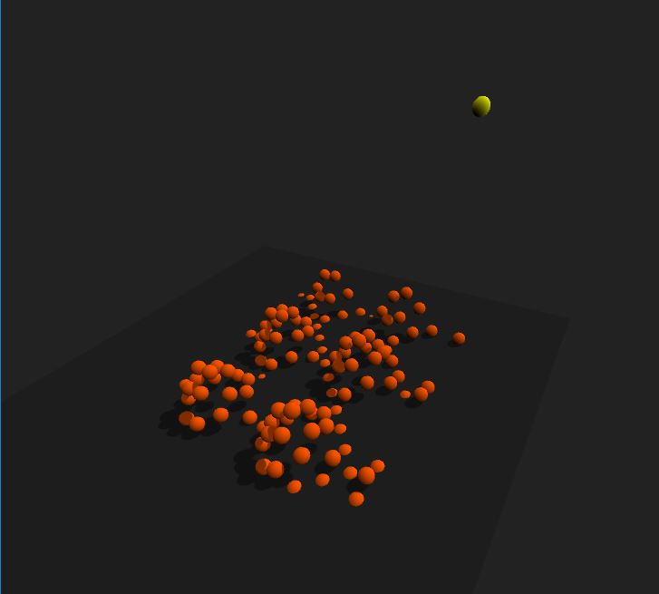
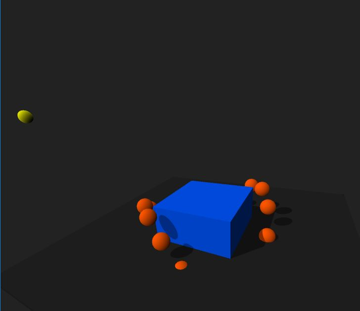
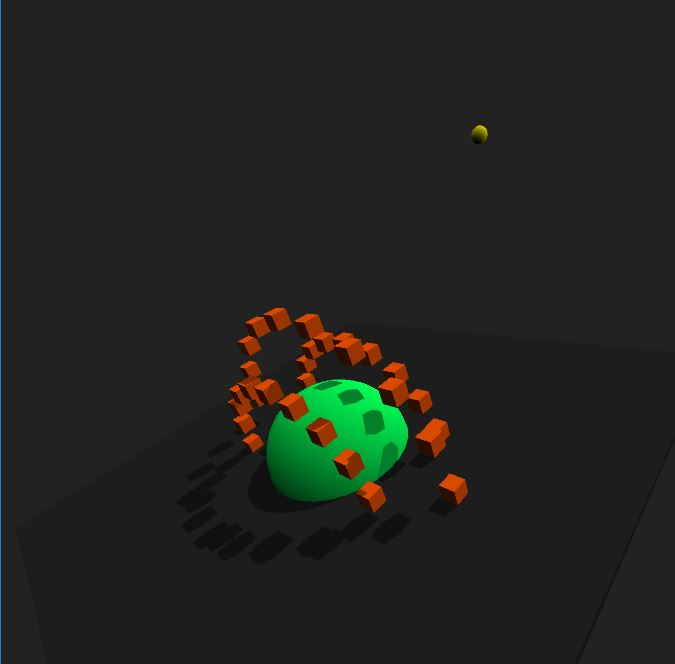

# Taller de interacción

## Propósito

Estudiar las tres tareas universales de interacción en entornos virtuales.

## Tareas

Escoja una de las siguientes tres:

1. Emplee un [dispositivo de interfaz humana](https://en.wikipedia.org/wiki/Human_interface_device) no convencional para controlar una escena. Refiérase al ejemplo [SpaceNavigator](https://github.com/VisualComputing/frames/tree/master/examples/basics/SpaceNavigator). Se puede emplear la escena del [punto 2 del taller de transformaciones](https://github.com/VisualComputing/Transformations_ws)
2. Implemente una aplicación de _cámara en tercera persona_. Refiérase al ejemplo [FlockOfBoids](https://github.com/VisualComputing/frames/tree/master/examples/demos/FlockOfBoids).
3. Implemente una aplicación de _control de la aplicación_ (e.g., ["marking menus"](https://www.youtube.com/watch?v=twR_yxuHw24) o [vistas auxiliares](https://www.youtube.com/watch?v=Kr6-_NT_olo&feature=youtu.be&t=214)).

En cualquier caso se puede emplear la librería [frames](https://github.com/VisualComputing/frames) y/o cualquier otra.

# Taller de shaders

## Propósito

Estudiar los [patrones de diseño de shaders](http://visualcomputing.github.io/Shaders/#/4).

## Tarea

Escoja una de las siguientes dos:

1. Hacer un _benchmark_ entre la implementación por software y la de shaders de varias máscaras de convolución aplicadas a imágenes y video.
2. Estudiar e implementar el [shadow mapping](http://www.opengl-tutorial.org/intermediate-tutorials/tutorial-16-shadow-mapping/). Se puede emplear la escena del [punto 2 del taller de transformaciones](https://github.com/VisualComputing/Transformations_ws), así como la librería [frames](https://github.com/VisualComputing/frames). Ver el ejemplo [ShadowMap](https://github.com/VisualComputing/frames/tree/master/examples/demos/ShadowMap).

## Integrantes

Máximo tres.

Complete la tabla:

| Integrante | github nick |
|------------|-------------|
| Santiago Orloff Orloff Rodríguez | Orloffyeah |

## Informe

En la elaboración del proyecto, primero se realizó la implementación del shadow mapping, debido a que la implementación de este podia afectar el rendimiento de la aplicación inicialmente, lo cual podía generar problemas mas adelante al agregar nuevas funcionalidades.

Inicialmente se obtuvieron resultados de muy baja definición, que mostraban las sombras muy pixeladas y representando cosas erroneamente. Debido a esto se realizó un cambio sobre el modo en el que se realiza el cálculo, creando shaders diferentes para la correcta inicialización de los datos.

Se hace uso de un shader "inicial" y otro predeterminado. El inicial se encarga de realizar las asignaciones de valores que son necesarias cuando todos los objetos están estáticos en el primer frame de la escena. Posteriormente lo que se realiza son pequeñas transformaciones sobre lo obtenido inicialmente, mejorando considerablemente el rendimiento y la fidelidad de las sombras.

Lo último a realizar fue un cambio al color que se le asignan a las sombras, ya que se presentaba el comportamiento que la oscuridad de dos sombras se "sumaba", en vez de simplemente volverse en una sola. Para controlar esto se pusieron controles de la intensidad de la luz en los shaders.

Finalmente, se implementaron unos objetos con movimientos básicos, para demostrar el funcionamiento del sombreado en tiempo real, sin importar que los objetos sean cambiados o la velocidad que posean.

## Entrega

Fecha límite Domingo 10/3/19 a las 24h.